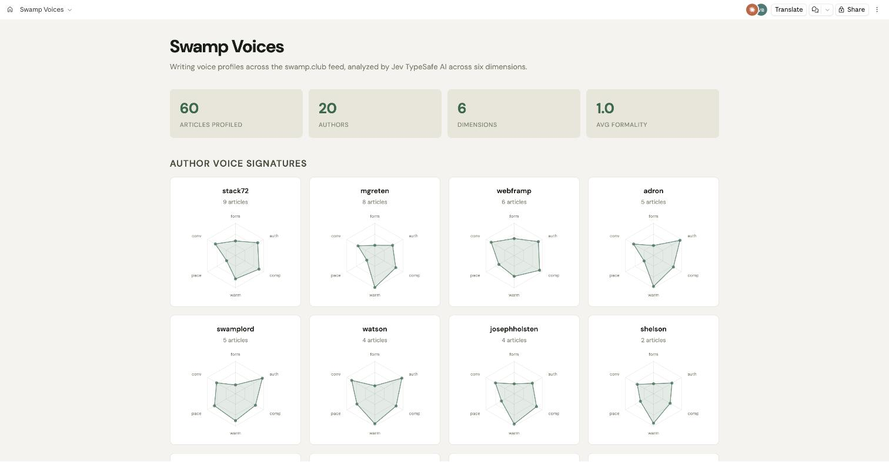
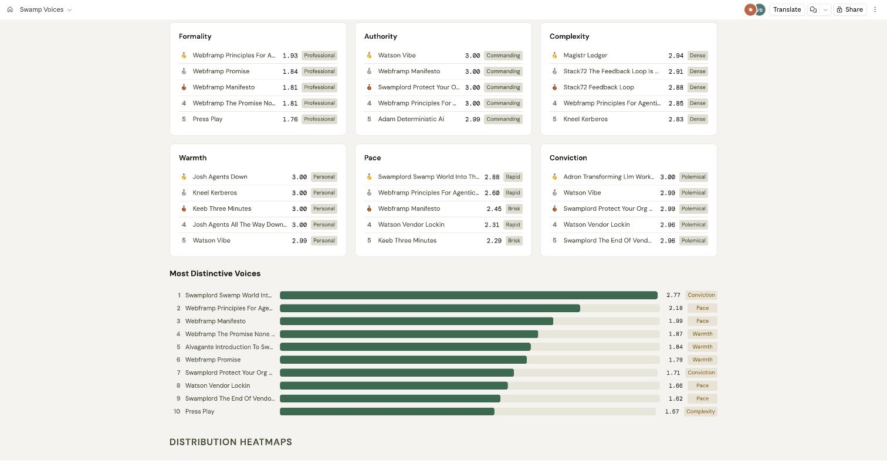
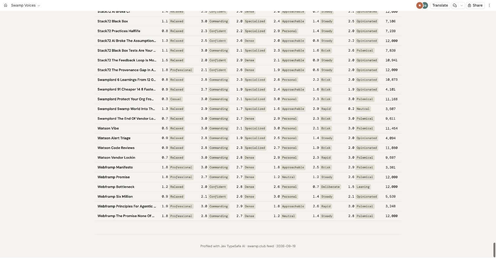

# @vcjdeboer/jev-voice

Multi-dimensional writing voice profiler powered by
[Jev](https://typesafe.ai). Analyze any text — articles, READMEs, docs,
papers, emails — across six voice dimensions with calibrated probabilities.



## Dimensions

| Dimension | Spectrum | What it measures |
| --- | --- | --- |
| **Formality** | casual ↔ formal | Word choice, register, sentence structure |
| **Authority** | tentative ↔ commanding | Hedging vs direct claims, imperative voice |
| **Complexity** | accessible ↔ dense | Vocabulary, assumed knowledge, abstraction depth |
| **Warmth** | clinical ↔ personal | Reader address, anecdotes, personality |
| **Pace** | deliberate ↔ rapid | Sentence length, transition speed, density |
| **Conviction** | neutral ↔ polemical | Strength of opinion, thesis clarity |

Each dimension returns a **score** (0-3), a **probability distribution** across
the four levels, and a **confidence**. A text that's 60% formal and 40%
conversational IS the profile — the probabilities are the insight.

## Quick start

```bash
swamp extension pull @vcjdeboer/jev-voice
swamp model create @vcjdeboer/jev-voice voice \
  --global-arg 'apiKey=${{ vault.get("typesafe", "TYPESAFE_API_KEY") }}'
```

### Profile a text

```bash
swamp model method run voice profile \
  --input text="$(cat article.md)" \
  --input label="My Article" \
  --input name="my-article"
```

### Compare two texts

```bash
swamp model method run voice compare \
  --input textA="$(cat readme-v1.md)" \
  --input textB="$(cat readme-v2.md)" \
  --input labelA="v1" \
  --input labelB="v2"
```

### In a workflow

```yaml
steps:
  - name: profile-readme
    task:
      type: model_method
      modelIdOrName: voice
      methodName: profile
      inputs:
        text: "${{ file.read('README.md') }}"
        label: "README"
        name: "readme"
  - name: check-tone
    dependsOn:
      - step: profile-readme
        condition:
          type: succeeded
    task:
      type: assert
      expression: >
        data.latest("voice", "profile-readme").attributes.warmth.score >= 2
      message: "README is too clinical — make it more engaging"
```

## Report: rankings and distinctiveness

The built-in voice-comparison report ranks articles per dimension and scores
distinctiveness — euclidean distance from the fleet centroid.



All 60 profiles in a filterable table:



See the [live report](https://claude.ai/artifact/LTerSUdzsGeYh7XNYbs8Tk) for
the full interactive version with radar charts, heatmaps, and author filters.

## Use cases

- **Pre-publish check**: Does your README sound right before you ship?
- **Voice consistency**: Compare docs across your project — are they in the
  same register?
- **Content analysis**: Profile a feed of articles and see whose writing is
  most authoritative, most approachable, most opinionated
- **Editing guidance**: Rewrite, re-profile, see what moved
- **Writing style study**: Compare your favorite authors' voices quantitatively

## How Jev fits writing analysis

Writing voice is inherently fuzzy — a text can be simultaneously formal and
warm, tentative yet complex. Traditional classifiers force a single label; Jev
returns calibrated probabilities across the full spectrum. A borderline text
gets low confidence, which is the honest answer. The domain knowledge lives in
the question framing (explicit rubric criteria), not in training data.

## License

MIT
